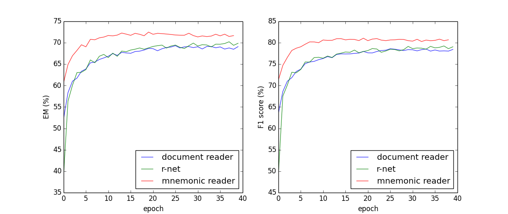

# Mnemonic Reader
The Mnemonic Reader is a deep learning model for Machine Comprehension task. You can get details from this [paper](https://arxiv.org/pdf/1705.02798.pdf). It combines advantages of [match-LSTM](https://arxiv.org/pdf/1608.07905), [R-Net](https://www.microsoft.com/en-us/research/wp-content/uploads/2017/05/r-net.pdf) and [Document Reader](https://arxiv.org/abs/1704.00051) and utilizes a new unit, the Semantic Fusion Unit (SFU), to achieve state-of-the-art results (at that time).

This model is a [PyTorch](http://pytorch.org/) implementation of Mnemonic Reader. At the same time, a PyTorch implementation of R-Net and a PyTorch implementation of Document Reader are also included to compare with the Mnemonic Reader. Pretrained models are also available in [release](https://github.com/HKUST-KnowComp/MnemonicReader/releases).

This repo belongs to [HKUST-KnowComp](https://github.com/HKUST-KnowComp) and is under the [BSD LICENSE](LICENSE).

Some codes are implemented based on [DrQA](https://github.com/facebookresearch/DrQA).

Please feel free to contact with Xin Liu (xliucr@connect.ust.hk) if you have any question about this repo.

### Evaluation on SQuAD

| Model                                 | DEV_EM | DEV_F1 |
| ------------------------------------- | ------ | ------ |
| Document Reader (original paper)      | 69.5   | 78.8   |
| Document Reader (trained model)       | 69.4   | 78.6   |
| R-Net (original paper 1)              | 71.1   | 79.5   |
| R-Net (original paper 2)              | 72.3   | 80.6   |
| R-Net (trained model)                 | 70.2   | 79.2   |
| Mnemonic Reader (original paper)      | 71.8   | 81.2   |
| Mnemonic Reader + RL (original paper) | 72.1   | 81.6   |
| Mnemonic Reader (trained model)       | 72.3   | 81.4   |



### Requirements

* Python >= 3.4
* PyTorch >= 0.31
* spaCy >= 2.0.0
* tqdm
* ujson
* numpy
* prettytable

### Prepare

First of all, you need to download the dataset and pre-trained word vectors.

```bash
mkdir -p data/datasets
wget https://rajpurkar.github.io/SQuAD-explorer/dataset/train-v1.1.json -O data/datasets/SQuAD-train-v1.1.json
wget https://rajpurkar.github.io/SQuAD-explorer/dataset/dev-v1.1.json -O data/datasets/SQuAD-dev-v1.1.json
```

```bash
mkdir -p data/embeddings
wget http://nlp.stanford.edu/data/glove.840B.300d.zip -O data/embeddings/glove.840B.300d.zip
cd data/embeddings
unzip glove.840B.300d.zip
```

Then, you need to preprocess these data.

```bash
python script/preprocess.py data/datasets data/datasets --split SQuAD-train-v1.1
python script/preprocess.py data/datasets data/datasets --split SQuAD-dev-v1.1
```

If you want to use multicores to speed up, you could add `--num-workers 4` in commands.

### Train

There are some parameters to set but default values are ready. If you are not interested in tuning parameters, you can use default values. Just run:

```bash
python script/train.py
```

After several hours, you will get the model in `data/models/`, e.g. `20180416-acc9d06d.mdl` and you can see the log file in `data/models/`, e.g. `20180416-acc9d06d.txt`.

### Predict

To evaluate the model you get, you should complete this part.

```bash
python script/predict.py --model data/models/20180416-acc9d06d.mdl
```

You need to change the model name in the command above.

You will not get results directly but to use the official `evaluate-v1.1.py` in `data/script`.

```bash
python script/evaluate-v1.1.py data/predict/SQuAD-dev-v1.1-20180416-acc9d06d.preds data/datasets/SQuAD-dev-v1.1.json
```

### Interactivate

In order to help those who are interested in QA systems, `script/interactivate.py` provides an easy but good demo.

```bash
python script/interactivate.py --model data/models/20180416-acc9d06d.mdl
```

Then you will drop into an interactive session. It looks like:

```
* Interactive Module *

* Repo: Mnemonic Reader (https://github.com/HKUST-KnowComp/MnemonicReader)

* Implement based on Facebook's DrQA

>>> process(document, question, candidates=None, top_n=1)
>>> usage()

>>> text="Architecturally, the school has a Catholic character. Atop the Main Building's gold dome is a golden statue of the Virgin Mary. Immediately in front of the Main Building and facing it, is a copper statue of Christ with arms upraised with the legend \"Venite Ad Me Omnes\". Next to the Main Building is the Basilica of the Sacred Heart. Immediately behind the basilica is the Grotto, a Marian place of prayer and reflection. It is a replica of the grotto at Lourdes, France where the Virgin Mary reputedly appeared to Saint Bernadette Soubirous in 1858. At the end of the main drive (and in a direct line that connects through 3 statues and the Gold Dome), is a simple, modern stone statue of Mary."
>>> question = "To whom did the Virgin Mary allegedly appear in 1858 in Lourdes France?"
>>> process(text, question)

+------+----------------------------+-----------+
| Rank |            Span            |   Score   |
+------+----------------------------+-----------+
|  1   | Saint Bernadette Soubirous | 0.9875301 |
+------+----------------------------+-----------+
```

### More parameters

If you want to tune parameters to achieve a higher score, you can get instructions about parameters via using

```bash
python script/preprocess.py --help
```

```bash
python script/train.py --help
```

```bash
python script/predict.py --help
```

```bash
python script/interactivate.py --help
```

## License

All codes in **Mnemonic Reader** are under [BSD LICENSE](LICENSE).